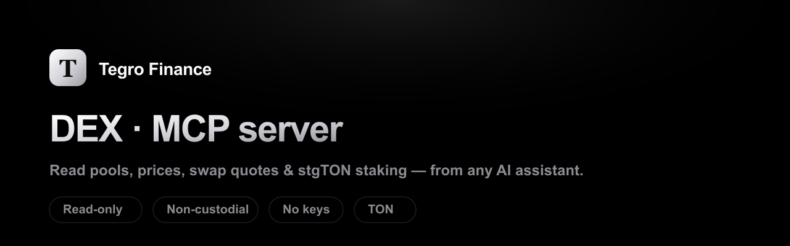

# Tegro Finance DEX — MCP server



[](https://www.npmjs.com/package/@tegroton/tegro-finance-mcp)
[](https://modelcontextprotocol.io)
[](LICENSE)
[](https://t.me/tegrofinance)
[](https://x.com/TegroDEX)

A [Model Context Protocol](https://modelcontextprotocol.io) server for the
**[Tegro Finance](https://tegro.finance) DEX** on [TON](https://ton.org) — let an
AI assistant (Claude, Cursor, …) read **pools, token prices, swap quotes and
liquid‑staking (stgTON) rates** in plain language.

> **Read‑only & non‑custodial.** No API keys, no wallet, no signing — nothing
> that can move funds. It only reads the public Tegro Finance API. Just run it.

## Tools

| Tool | What it does |
|---|---|
| `tegro_dex_pools` | All liquidity pools — reserves, fees, TVL, APYs |
| `tegro_dex_pools_for_token` | Pools that contain a given token |
| `tegro_dex_assets` | The tradable‑token registry |
| `tegro_dex_token` | Price / holders / liquidity / trust score for a token |
| `tegro_dex_quote_swap` | Quote an exact‑in swap (read‑only; no tx built) |
| `tegro_staking_pools` | Liquid‑staking pools (stgTON & others) + APY |
| `tegro_staking_rate` | Live stgTON→TON rate for a pool |

## Install

### Claude Desktop

Add to `claude_desktop_config.json`:

```json
{
  "mcpServers": {
    "tegro-finance": {
      "command": "npx",
      "args": ["-y", "@tegroton/tegro-finance-mcp"]
    }
  }
}
```

### Cursor / Windsurf / other MCP clients

Same shape — `command: npx`, `args: ["-y", "@tegroton/tegro-finance-mcp"]`. No
config needed. Then ask: *"What are the top Tegro Finance pools by TVL?"*,
*"Quote 100 TON → USDT on Tegro"*, or *"What's the stgTON staking APY?"*

## How it works

Thin wrapper over the official **[`@tegroton/tegro-finance`](https://www.npmjs.com/package/@tegroton/tegro-finance)**
SDK, which reads the public Tegro Finance API. The SDK is non‑custodial: building
or signing a real swap happens in the user's own wallet and is intentionally
**not** part of this read‑only server.

## Tegro Finance ecosystem

- **SDK** — [`tegro-finance-sdk`](https://github.com/TegroTON/tegro-finance-sdk) · [`@tegroton/tegro-finance`](https://www.npmjs.com/package/@tegroton/tegro-finance) — typed read/quote/build client + TON Connect adapter (powers this server)
- **DEX API** — [`API-DEX-TON-Blockchain`](https://github.com/TegroTON/API-DEX-TON-Blockchain) — the public DEX REST API
- **Liquid staking** — [`ton-gram-staking-docs`](https://github.com/TegroTON/ton-gram-staking-docs) — stgTON docs, contracts & API
- **App** — [tegro.finance](https://tegro.finance) · **Docs** — [docs.tegro.finance](https://docs.tegro.finance)

## Other AI surfaces

Same read-only API, every assistant — see [`integrations/`](integrations/): `llms.txt`, an agent guide, a curated OpenAPI, a ChatGPT custom-GPT recipe, and Hermes/function-calling tools. `llms.txt` is live at <https://tegro.finance/llms.txt>.

## Community

Telegram [@tegrofinance](https://t.me/tegrofinance) · X [@TegroDEX](https://x.com/TegroDEX)

## Security

Read‑only. No keys, no signing, no funds. Outbound HTTPS only to the Tegro
Finance API. See [SECURITY.md](SECURITY.md).

## Develop

```bash
npm install
npm run build
node dist/index.js   # stdio MCP server
```

MIT © TegroTON
